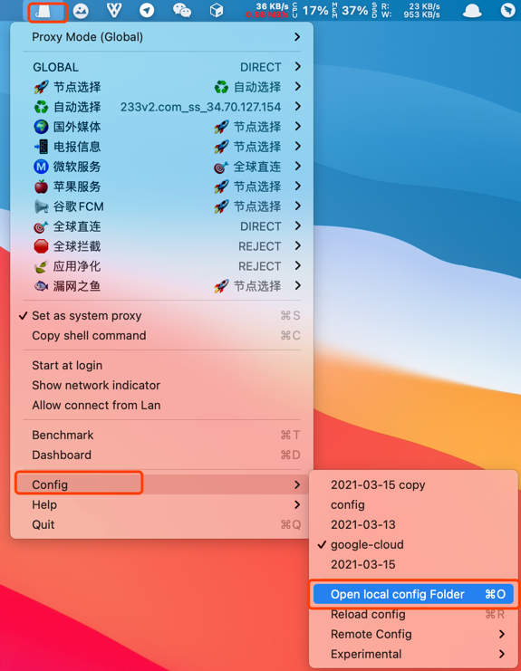
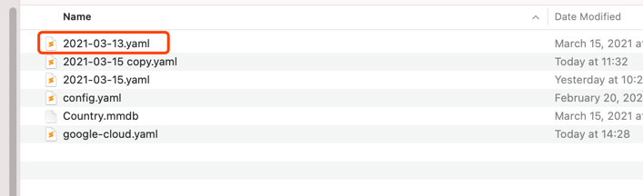

大家好，我是猿小札。 免费分享最新最快科学上网方法， 破解VPN，科学上网翻墙方法，实用教程，实用电脑手机APP。 记得订阅我哦！并且打开小铃铛哦！多多点赞，评论，我会保持更新！ 
更多内容请看：https://www.youtube.com/channel/UCLyUXIEt4vuyjxY6RoL36kQ  

免责声明： 本频道提供的任何资源教程，仅仅是技术交流，请在24小时内删除，切勿传播。假如你使用了任何本频道提供的资源教程，请遵守所在国的法律法规 切勿用于涉及政治宗教色情犯罪等领域发布违法言论，一切违法后果请自负。

【使用方法】
- 1、下载clash客户端

    mac版本：https://github.com/yichengchen/clashX/releases/download/1.40.0/ClashX.dmg
  
    windows版本：https://github.com/Fndroid/clash_for_windows_pkg/releases

- 2、下载配置文件到本地
- 3、打开clash客户端，选择【open local config folder】
    
  
- 4、把下载的配置文件放到配置的文件中
    
  
- 5、打开clash客户端，设置为系统代理，【set as system proxy】
    
  
- 6、打开地址：https://www.youtube.com/channel/UCLyUXIEt4vuyjxY6RoL36kQ ，验证科学上网
  

【自定义订阅链接】

- 模板配置文件：template.yaml
- 自己制作配置文件：diy.yaml
- 生成订阅链接网站：https://acl4ssr-sub.github.io

